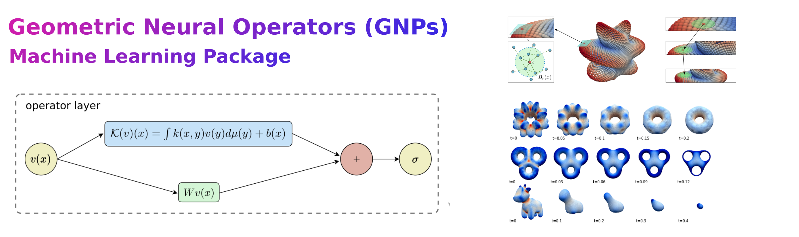

.. Geometric Neural Operator documentation master file, created by
   sphinx-quickstart on Sun Mar  2 16:38:53 2025.
   You can adapt this file completely to your liking, but it should at least
   contain the root `toctree` directive.

Geometric Neural Operator documentation
=======================================

Geometric Neural Operators (GNPs) allow for data-driven deep learning
of features from point-cloud representations and other 
datasets for tasks involving geometry.   This includes training 
protocols and learned operators for estimating local curvatures,
evaluating geometric differential operators, solvers for 
PDEs on manifolds, mean-curvature shape flows, and other tasks.
The package provides practical neural network architectures and factorizations 
for training to accounting for geometric contributions and features.  The package also 
has a modular design allowing for use of GNPs within other data-processing pipelines.
Pretrained models are also provided for estimating curvatures, Laplace-Beltrami operators,
components for PDE solvers, and other geometric tasks.

If you find these methods or codes helpful in your project, please cite:

B. Quackenbush, P.J. Atzberger,  “Transferable Foundation Models for Geometric Tasks on 
Point Cloud Representations: Geometric Neural Operators,” arXiv, (2025),
`<https://arxiv.org/abs/2503.04649>`_.

B. Quackenbush, P.J. Atzberger,  “Geometric neural operators (gnps) for data-driven deep
learning in non-euclidean settings,” Machine Learning: Science and Technology, 5(4), (2024),
`<https://doi.org/10.1088/2632-2153/ad8980>`_.

.. toctree::
   :maxdepth: 1
   :caption: Package Reference:

   gnp.estimator
   gnp.models
   gnp.geometry
   gnp.dataset
   gnp.utils
   gnp.config

Links:
-----------------
* `GitHub for Codes / Examples`_
.. _GitHub for Codes / Examples: https://github.com/atzberg/geo_neural_op
* `Atzberger Research Group`_
.. _Atzberger Research Group: https://atzberger.org
