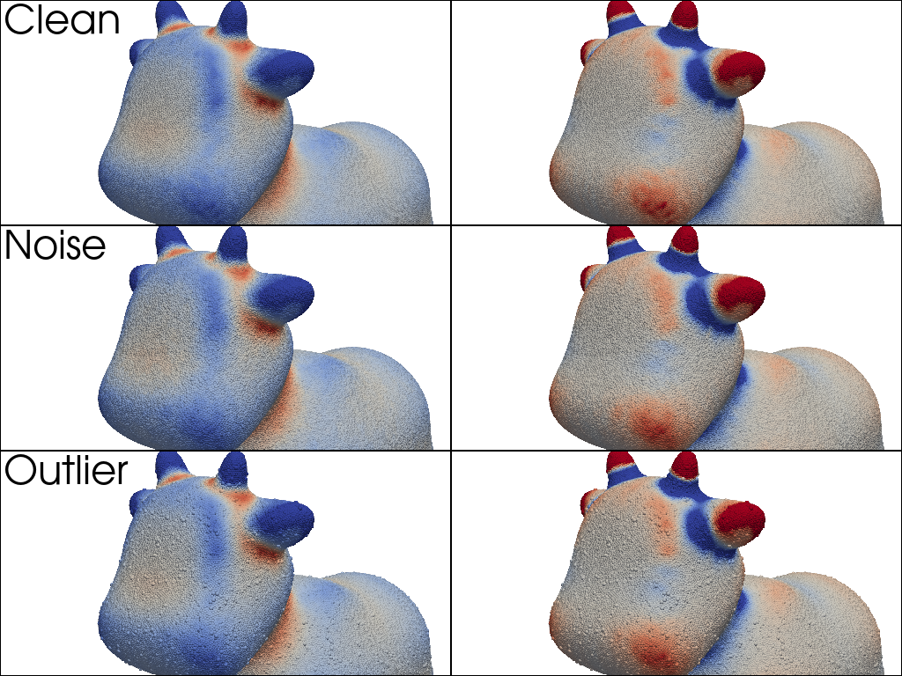
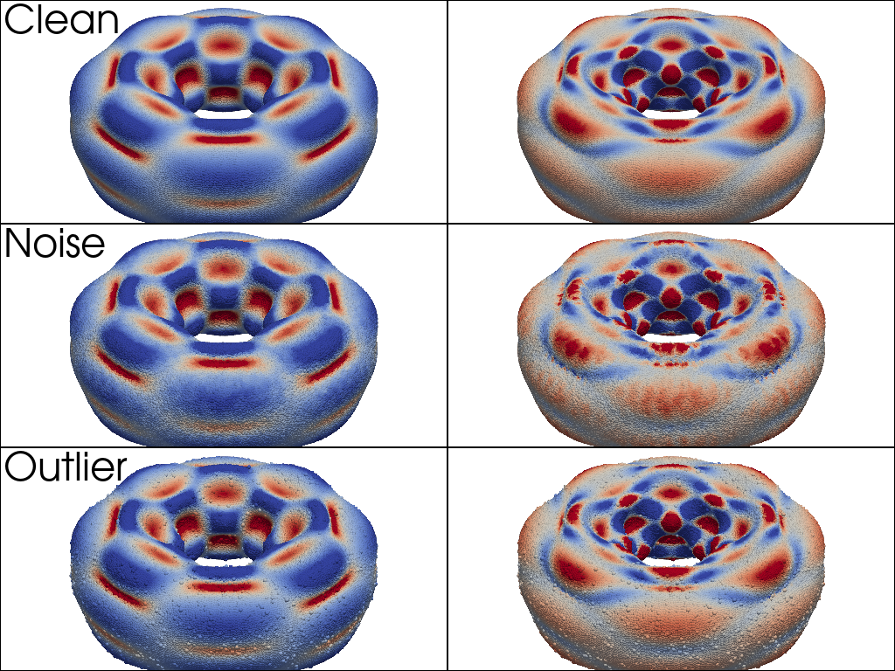
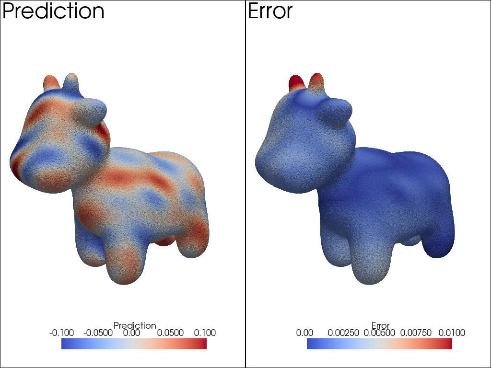
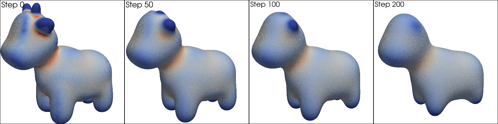

### Examples
----
Pretrained models are loaded when instantiatiating the ```GeometryEstimator``` class. This can be used to gather geometric quantities and more by instantiating:
```python
import numpy as np
import torch
from gnp import GeometryEstimator
pcd = torch.from_numpy(np.load('example_data/spot/xyz.npy'))
orientation = torch.from_numpy(np.load('example_data/spot/normals.npy'))
estimator = GeometryEstimator(pcd=pcd,
                              orientation=orientation,
                              model='clean_30k')
```


#### GNPs for Estimating Curvatures 
Geometric quantities can be easily generated using
```python
outputs = estimator.estimate_quantities(['mean_curvature', 'gaussian_curvature'])
```

<p align="center">
<br>
 
 
</p>

See our [example code](./curvatures_01/curvatures.ipynb).

----
#### GNPs for Solving PDEs on Manifolds 
A stiffness matrix for the Laplace-Beltrami equation $-\Delta_{\text{LB}} u = f$
using Generalized Moving Least Squares (GMLS) can be constructed
```python
stiffness_matrix = estimator.stiffness_matrix_gmls(drop_ratio=0.1,
                                                   radius=1,
                                                   p=4,
                                                   remove_outliers=False)
```
<p align="center">
<br>
 
</p>

This can be paired with your favorite linear solvers and/or preconditioners. 
We use Scipy's LGMRES and PyAMG for preconditioning. See our collocation 
[example code](./collocation_01/collocation.ipynb)

----
#### GNPs for Curvature Driven Flows

Mean curvature flows (MCF) can be simulated using 
```python
flow_data = estimator_clean.mean_flow(num_steps=250, 
                                      save_data_per_step=25,
                                      delta_t=0.0002,
                                      subsample_radius=0.005,
                                      smooth_radius=0.06,
                                      smooth_x=False)
```


<p align="center">
<br>
 
</p>
----

See our [example code](./mean_flows_01/mean_flow.ipynb).

